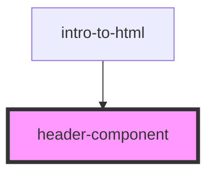

# header-component

<!-- Auto Generated Below -->

## Dependencies

### Used by

 - [intro-to-html](../intro-to-html)

### Graph

----------------------------------------------

*Built with [StencilJS](https://stenciljs.com/)*
