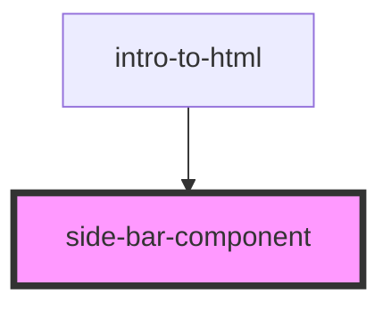

# side-bar-component

<!-- Auto Generated Below -->

## Properties

| Property       | Attribute        | Description | Type     | Default     |
| -------------- | ---------------- | ----------- | -------- | ----------- |
| `menuItemIcon` | `menu-item-icon` |             | `string` | `undefined` |
| `menuItemName` | `menu-item-name` |             | `string` | `undefined` |

## Dependencies

### Used by

 - [intro-to-html](../intro-to-html)

### Graph

----------------------------------------------

*Built with [StencilJS](https://stenciljs.com/)*
