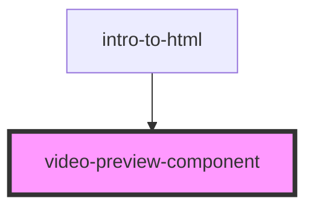

# video-preview-component

<!-- Auto Generated Below -->

## Properties

| Property        | Attribute         | Description | Type     | Default     |
| --------------- | ----------------- | ----------- | -------- | ----------- |
| `author`        | `author`          |             | `string` | `undefined` |
| `channelImgSrc` | `channel-img-src` |             | `string` | `undefined` |
| `imgSrc`        | `img-src`         |             | `string` | `undefined` |
| `stats`         | `stats`           |             | `string` | `undefined` |
| `videoTime`     | `video-time`      |             | `string` | `undefined` |
| `videoTitle`    | `video-title`     |             | `string` | `undefined` |

## Dependencies

### Used by

 - [intro-to-html](../intro-to-html)

### Graph

----------------------------------------------

*Built with [StencilJS](https://stenciljs.com/)*
